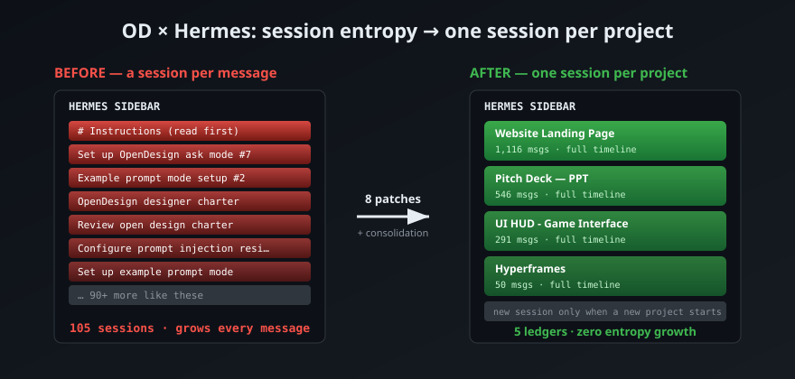
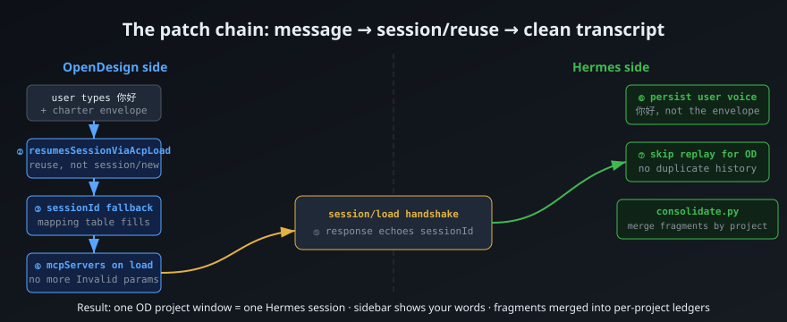

# OD-Hermes Session Fix

**One OpenDesign project window = one Hermes session. No more session-per-message entropy.**

Fixes the OpenDesign ↔ Hermes Agent ACP integration so that chatting in an OD project window reuses a single Hermes session instead of spawning a new one for every message — plus tools to clean up the damage: translate the English charter envelopes back to the user's actual words, and consolidate fragmented sessions into per-project archives.

> If your Hermes sidebar looks like this — dozens of sessions titled `# Instructions (read first)`, `Set up OpenDesign ask mode #7`, `Example prompt mode setup #2` — this is for you.

```
Before: 105 sessions, 90 of them template-named fragments, growing every message
After:   5 sessions (one per OD project), named after the OD project, zero growth
```





## The Problem

[OpenDesign](https://github.com/open-design) (OD) drives Hermes Agent through ACP (Agent Client Protocol). Out of the box, this integration has **8 defects** that compound into unusable session entropy:

| # | Defect | Symptom |
|---|--------|---------|
| ② | OD never enables session reuse for Hermes | Every message spawns a fresh `session/new` |
| ③ | Session capture only reads OpenCode's proprietary `openCodeSessionId` | The `agent_sessions` mapping table stays empty forever |
| ④ | `session/load` requests miss the required `mcpServers` field | OD shows `json-rpc id 2: Invalid params` on resume |
| ⑤ | Hermes' `session/load` response lacks `sessionId` | OD rejects the handshake: `invalid session/new response` |
| ⑥ | Hermes persists the entire English charter envelope | Sidebar titles, transcripts, full-text search all show envelope boilerplate — the user's actual words (often Chinese) are buried |
| ⑦ | Resume replays the entire history into the client | Every new message first re-renders hours-old replies |
| ⑥b | Envelope tail markers come in **two** variants (`## user` and `# User request`) | Naive extraction silently fails for half the envelopes |
| — | OD auto-update swaps the version directory | Disk patches silently lost after every OD update |

None of this is your fault, and none of it is configurable — it's baked into the current OD↔Hermes integration. But it's all patchable.

## What You Get

### 1. Session Reuse (the faucet fix)

One OD project window = one Hermes session = one complete design history. Opening a new OD window is what starts a new session — nothing else does.

### 2. Envelope → User Voice (transcript hygiene)

Hermes stores what the model should see; your sidebar, titles, and search now store what **you** actually typed:

```
Before (stored):  # Instructions (read first)\n# Open Design charter\n...(3,432 chars of English)...
After  (stored):  "Hi, are you there?"
```

The model still receives the full envelope (it needs the project context) — only the archive is cleaned.

### 3. Fragment Consolidation (the mop)

Existing fragments are auto-assigned to OD projects via the project UUID embedded in every envelope, then merged into one "ledger" session per project:

- Messages are re-attributed by rewriting `session_id` (one transaction)
- Timeline order is preserved automatically — Hermes resumes by auto-increment row id, which *is* chronological order
- Ledger sessions are renamed to the OD project's name, so the sidebar reads like your project list
- The OD↔session mapping table is pre-filled so the next message in each OD window resumes the ledger seamlessly

### 4. Interactive Cleanup (your choice, always)

After consolidation the tool **asks before deleting anything**. Fragments can be archived (soft-hide, reversible), kept, or hard-deleted. Default is archive.

## Repo Contents

| Path | What it is |
|------|-----------|
| `skills/od-hermes-session-reuse/SKILL.md` | Skill 1 — the patch chain: diagnosis map, 8 fixes, verification steps, pitfalls |
| `skills/od-fragment-consolidator/SKILL.md` | Skill 2 — merge fragments into per-project ledgers, rename to OD project names, interactive cleanup |
| `scripts/diagnose.py` | Read-only health check: counts fragments, detects which of the 8 defects apply to your install |
| `scripts/consolidate.py` | The consolidator: envelope→voice translation + per-project merge + interactive cleanup |
| `docs/PATCHES.md` | The 8 patches in surgical detail (exact anchors, backups, rollback) |
| `docs/TROUBLESHOOTING.md` | Every pitfall we hit, with fixes |

## Quick Start

```bash
# 1. Diagnose (read-only, changes nothing)
python scripts/diagnose.py

# 2. Apply the OD-side patches (②③④) — see docs/PATCHES.md
#    Each patch: backup → one-line edit → node --check → restart OD

# 3. Apply the Hermes-side patches (⑤⑥⑦) — see docs/PATCHES.md
#    These take effect on the next message; no restart needed

# 4. Clean up history
python scripts/consolidate.py          # dry-run first, asks before every destructive step
python scripts/consolidate.py --apply  # then apply
```

## Requirements

- Windows (OD desktop), Hermes Agent with the `design`-style profile layout
- Python 3.10+ (stdlib only for diagnose; consolidate uses sqlite3)
- Your OD data lives in `%APPDATA%\Open Design\namespaces\release-stable-win\`
- A full backup is taken automatically before any write

## Safety Model

- Every patch ships with a `.bak-<date>` backup and a one-command rollback
- `consolidate.py` runs dry-run by default; destructive actions require an explicit prompt
- Session data is **never deleted** by the merge — messages are re-attributed, not dropped
- The OD mapping write degrades gracefully: if it fails, resume simply falls back to a fresh session (the pre-patch behavior)

## Verified Results

Tested on a real installation with 105 sessions / 3,455 messages accumulated over 5 days:

- 94 fragments auto-assigned to 4 OD projects (89 with high confidence, 5 empty shells flagged)
- 95 envelopes translated to user voice (0 residual after two-pass extraction)
- 1,933 messages merged into 5 project ledgers, timelines verified monotonic
- Post-merge resume: context intact (the model recalled tasks from hours-old turns)
- Alternation breaks (user;user) detected and auto-repaired by Hermes' built-in `repair_alternation`

## Language

The skill and scripts run inside an LLM agent: **they converse in whatever language you use.** Documentation is English for maximum reach; the runtime experience adapts to you — a Chinese-language user gets a fully Chinese session, a Spanish user gets Spanish, and so on.

## License

MIT
